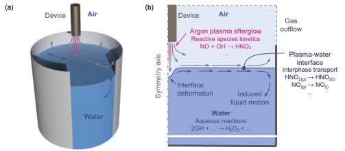

# OpenFOAM-custom-libraries
This repository contains the computational modeling solver and associated libraries I have developed in my PhD journey.
All code was written for OpenFOAM-v1812, nevertheless should be portable to more modern versions of software. The code was tested on macOS Monterey 12.1, CentOS v7, and generally should be easily portable to any Linux distribution (as long as OpenFOAM itseld was correctly installed). 

If you find this code helpful in your research please be sure to cite my paper.

## interPlasmaFoam
Main solver `interPlasmaFoam` models turbulent gas flow, gas-liquid dynamic interface, multiphase reactive chemical species transport.
Volume-of-Fluid (VoF) approach is employed for capturing the multiphase flow and is coupled with the Chien's low-Reynolds k-$\varepsilon$ turbulence model.

Multiphase species transport is modeled using 3 implemented approaches: 
- Model by Haroun et al. 2010 employing Harmonic averaging of diffusivities
- Marschall et al. 2012 model using Arithmetic averaging of diffusivities
- The Continuous Species Transport model developed by Deising et al. 2016. Essentially, blends both approaches

Chemical reactions are modeled in both phases and generally accounted for in the form of source term in the species conservation equation.
To ensure smooth transition in the interface region smoothstep function is implemented.

Gauss's law for electric potential and charge is solved. Effect of created electric fields on the interface deformation is coupled with the VoF approach.

`interPlasmaFoam` was employed to study the interaction of atmospheric pressure plasma jet device impinging on water interaction. Schematics are in the picture:




## Custom libraries
`TurbulenceModels` implements Chien's low-Reynolds k-$\epsilon$ turbulence model preserving the OOP approach of OpenFOAM in regards to available out-of-box turbulence models.

`transportModels` implements non-isothermal two-fluids model. It has required temperature, specific heats, and conductivities functionality for solving the energy conservation equation.

`reactionMultiphase` is the base class for multiphase reaction. It parses the reaction written in the following form: 
```
NO + OH + H202 = HNO2 + H202
```

`multiphaseChemistryModel` creates the chemical kinetics model for an arbitrary number of chemical species and reactions.

Example of the folders and files structure is shown in folder `example-simulation-folder`.